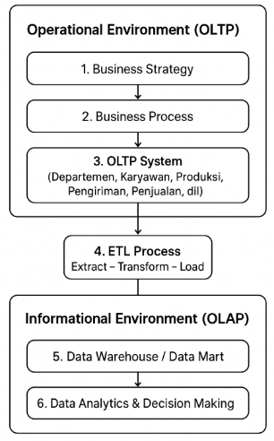
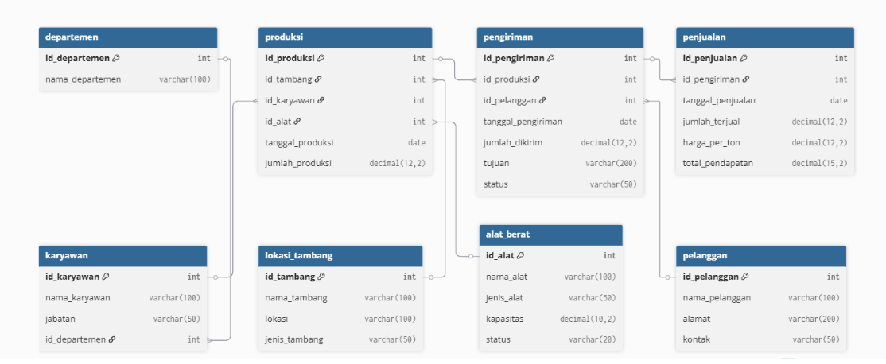

# 📘 Runbook: Data Warehouse PT. XYZ

## Kelompok 2 Kecerdasan Bisnis

> **Dokumen Operasional Standar (SOP)** untuk menjalankan, memonitor, dan memelihara infrastruktur Data Warehouse PT. XYZ menggunakan Docker Compose.

**Terakhir Diperbarui:** 22 Oktober 2025  
**Versi:** 1.0

---

## 📑 Daftar Isi

- [1. Sistem & Arsitektur](#1-sistem--arsitektur)
- [2. Prasyarat (Prerequisites)](#2-prasyarat-prerequisites)
- [3. Instalasi dan Konfigurasi](#3-instalasi-dan-konfigurasi)
- [4. Menjalankan Aplikasi](#4-menjalankan-aplikasi)
- [5. Verifikasi dan Monitoring](#5-verifikasi-dan-monitoring)
- [6. Prosedur Operasional Harian](#6-prosedur-operasional-harian)
- [7. Desain OLTP](#7-desain-oltp)
- [8. Scheduling ETL](#8-scheduling-etl)
- [9. Insight Business Intelligence](#9-insight-business-intelligence)
- [10. Perbandingan Arsitektur](#10-perbandingan-arsitektur)

---

## 1. Sistem & Arsitektur

### 1.1. Deskripsi Sistem

Sistem Data Warehouse PT. XYZ dirancang untuk mengekstrak data dari sistem operasional (OLTP) ke Data Warehouse (DWH) untuk analisis Business Intelligence. Seluruh proses orkestrasi ETL (Extract, Transform, Load) dikelola oleh **Apache Airflow**.

**Alur Data:**

```
Operational Environment (OLTP)
   ├── Business Strategy
   ├── Business Process
   └── OLTP System
         ↓
   ETL Process (Airflow)
         ↓
Informational Environment (OLAP)
   ├── Data Warehouse / Data Mart
   └── Data Analytics & Decision Making
```

### 1.2. Arsitektur Komponen

Sistem terdiri dari beberapa layanan Docker yang saling bergantung:

| Layanan           | Deskripsi                                           |
| ----------------- | --------------------------------------------------- |
| sqlserver         | Database OLTP utama (SQL Server 2022) - sumber data |
| postgres          | Database metadata untuk Apache Airflow              |
| redis             | Message broker untuk antrian tugas (Celery) Airflow |
| airflow-webserver | Antarmuka (UI) Apache Airflow                       |
| airflow-scheduler | Penjadwal utama yang memicu eksekusi DAG (pipeline) |
| airflow-worker    | Worker yang menjalankan tugas-tugas ETL             |
| superset          | Platform visualisasi dan analitik                   |
| jupyter           | Notebook untuk analisis data ad-hoc                 |
| grafana           | Dashboard monitoring                                |
| metabase          | Business Intelligence tool                          |
| db_init           | Layanan one-time untuk inisialisasi skema/data awal |

---

## 2. Prasyarat (Prerequisites)

Pastikan sistem Anda memenuhi persyaratan minimum berikut:

### 2.1. Software Requirements

- **Docker Engine:** Versi `20.10+`
- **Docker Compose:** Versi `V2+`

### 2.2. Hardware Requirements

- **RAM:** Minimal 8 GB
- **Disk:** Minimal 20 GB ruang kosong

---

## 3. Instalasi dan Konfigurasi

### 3.1. Clone Repository

```bash
# Clone repositori proyek (ganti [URL_REPO_ANDA] dengan URL Git Anda)
git clone [URL_REPO_ANDA]/DW_Project_Kelompok22.git

# Masuk ke direktori proyek
cd DW_Project_Kelompok22
```

### 3.2. Setup Environment Variables

```bash
# Salin file environment template
cp env.example .env
```

**Isi file `.env`:**

```ini
# Atur password yang awalnya ini
MSSQL_SA_PASSWORD=YourSecurePassword123!

# Menjadi:
MSSQL_SA_PASSWORD=PTXYZSecure123!
```

### 3.3. Modifikasi `docker-compose.yml`

#### 3.3.1. Tambahkan Healthcheck untuk Superset

```yaml
services:
  superset:
    # ... (konfigurasi superset lainnya)
    healthcheck:
      test: ["CMD-SHELL", "curl -f http://localhost:8088/health"]
      interval: 30s
      timeout: 30s
      retries: 5
      start_period: 300s
```

#### 3.3.2. Pastikan SQL Server Menggunakan Environment Variable

```yaml
services:
  sqlserver:
    # ...
    environment:
      - ACCEPT_EULA=Y
      - MSSQL_SA_PASSWORD=${MSSQL_SA_PASSWORD} # <-- Pastikan ini ada
```

#### 3.3.3. Tambahkan Healthcheck untuk SQL Server

```yaml
services:
  sqlserver:
    # ... (environment di atas)
    healthcheck:
      test: ["CMD-SHELL", "/opt/mssql-tools18/bin/sqlcmd -S localhost -U sa -P '${MSSQL_SA_PASSWORD}' -Q 'SELECT 1' -C -N"]
      interval: 30s
      timeout: 10s
      retries: 10
      start_period: 60s
```

### 3.4. Pastikan Isi `requirements.txt`

```txt
pandas
pyodbc
python-dotenv
sqlalchemy
```

### 3.5. Modifikasi Kode ETL `standaloneetl.py`

#### 3.5.1. Update Path CSV

Ganti bagian path raw data:

```python

# Ganti Path ini
BASE_DATA_PATH = os.path.join('data', 'raw', 'Dataset')

# Dengan path dengan data yang disediakan sesuai dengan repositori github
equipment_path = os.path.join(BASE_DATA_PATH, 'dataset_alat_berat_dw.csv')
production_path = os.path.join(BASE_DATA_PATH, 'dataset_production.csv')
transaction_path = os.path.join(BASE_DATA_PATH, 'dataset_transaksi.csv')

# Pastikan Anda menggunakan variabel ini saat membaca CSV
# cth: equipment_df = pd.read_csv(equipment_path)
```

#### 3.5.2. Ganti Fungsi Koneksi Database

```python
def get_sql_connection():
    """Membuat koneksi SQL Server menggunakan pyodbc"""
    try:
        # Mengambil password dari environment variable
        load_dotenv()
        db_password = os.getenv('MSSQL_SA_PASSWORD')
        if not db_password:
            raise ValueError("Password SQL Server tidak ditemukan di environment variable MSSQL_SA_PASSWORD")

        conn_str = (
            r'DRIVER={ODBC Driver 18 for SQL Server};'
            r'SERVER=sqlserver,1433;'  # 'sqlserver' adalah nama layanan di docker-compose
            r'DATABASE=PTXYZ_DataWarehouse;'
            r'UID=sa;'
            r'PWD=' + db_password + ';'
            r'TrustServerCertificate=yes;'
        )

        logging.info("Mencoba terhubung ke SQL Server menggunakan pyodbc...")
        conn = pyodbc.connect(conn_str)
        logging.info("Koneksi ke SQL Server berhasil!")
        return conn
    except Exception as e:
        logging.error(f"Error terhubung ke SQL Server dengan pyodbc: {str(e)}")
        raise
```

### 3.6. Verifikasi File `.env`

```bash
# Perintah ini akan menampilkan detail file .env jika ada
ls -la .env
```

### 3.7. Mengubah Format di `init-db.sh`

Pastikan file `init-db.sh` menggunakan format **LF (Line Feed)**, bukan **CRLF (Carriage Return + Line Feed)**.  
Perbedaan ini penting karena:

- **LF** adalah format standar baris baru di sistem **Linux/Mac**, tempat Docker container biasanya dijalankan.
- **CRLF** adalah format baris baru di **Windows**, yang dapat menyebabkan error seperti:

---

## 4. Menjalankan Aplikasi

### 4.1. Bersihkan Docker (Opsional tapi Direkomendasikan)

```bash
# Untuk memastikan tidak ada konflik, hapus semua kontainer dan volume yang ada
docker system prune -af --volumes
```

### 4.2. Bangun dan Jalankan Layanan

```bash
# Perintah ini akan membangun image dan menjalankan semua layanan di latar belakang
docker compose up -d
```

---

## 5. Verifikasi dan Monitoring

### 5.1. Tunggu Inisialisasi

Beri waktu **5-10 menit** agar semua layanan (terutama `sqlserver` dan `superset`) selesai melakukan inisialisasi internal.

### 5.2. Periksa Status Container

```bash
# Jalankan perintah berikut untuk melihat status semua layanan
docker compose ps
```

**Hasil yang Diharapkan:**
Anda seharusnya melihat semua layanan dalam status `running` atau `healthy`. Jika statusnya `starting` atau `unhealthy`, tunggu beberapa saat lagi atau periksa log dengan:

```bash
docker compose logs [NAMA_LAYANAN]
```

### 5.3. Jalankan ETL Pipeline

Setelah memastikan semua service dalam status **healthy** atau **running**:

```bash
# Jalankan ETL pipeline
python standaloneetl.py
```

### 5.4. Akses Dashboards

```bash
# Akses dashboards menggunakan script helper
./open_dashboards.sh
```

---

## 6. Prosedur Operasional Harian

### 6.1. Prasyarat

Sebelum menjalankan sistem, pastikan hal berikut:

1. **Docker** dan **Docker Compose** terinstal di server host.
2. File `.env` sudah ada dan terisi dengan benar (terutama `MSSQL_SA_PASSWORD`, `POSTGRES_PASSWORD`, dll.).

### 6.2. Menjalankan Sistem

Untuk memulai semua layanan dalam mode _detached_ (background):

```bash
docker compose up -d
```

### 6.3. Menghentikan Sistem

```bash
# Stop semua service
docker compose stop

# Stop dan hapus container
docker compose down
```

---

## 7. Desain OLTP

### 7.1. Overview

Sistem OLTP (Online Transaction Processing) PT. XYZ berfungsi sebagai sistem operasional utama yang menangani transaksi harian perusahaan pertambangan. Sistem ini dirancang dengan model relasional menggunakan normalisasi hingga **3NF (Third Normal Form)** untuk menghindari duplikasi data dan menjaga integritas relasi antar entitas.



### 7.2. Entity Relationship Diagram



```dbml
// =============================================
// OLTP PT. XYZ - Sistem Operasional Industri Pertambangan
// Format: dbdiagram.io (.dbml)
// =============================================

// Master data
Table departemen {
  id_departemen int [pk, increment]
  nama_departemen varchar(100)
}

Table karyawan {
  id_karyawan int [pk, increment]
  nama_karyawan varchar(100)
  jabatan varchar(50)
  id_departemen int [ref: > departemen.id_departemen]
}

Table lokasi_tambang {
  id_tambang int [pk, increment]
  nama_tambang varchar(100)
  lokasi varchar(100)
  jenis_tambang varchar(50)
}

Table alat_berat {
  id_alat int [pk, increment]
  nama_alat varchar(100)
  jenis_alat varchar(50)
  kapasitas decimal(10,2)
  status varchar(20)
}

// Transaksi utama
Table produksi {
  id_produksi int [pk, increment]
  id_tambang int [ref: > lokasi_tambang.id_tambang]
  id_karyawan int [ref: > karyawan.id_karyawan]
  id_alat int [ref: > alat_berat.id_alat]
  tanggal_produksi date
  jumlah_produksi decimal(12,2)
}

Table pelanggan {
  id_pelanggan int [pk, increment]
  nama_pelanggan varchar(100)
  alamat varchar(200)
  kontak varchar(50)
}

Table pengiriman {
  id_pengiriman int [pk, increment]
  id_produksi int [ref: > produksi.id_produksi]
  id_pelanggan int [ref: > pelanggan.id_pelanggan]
  tanggal_pengiriman date
  jumlah_dikirim decimal(12,2)
  tujuan varchar(200)
  status varchar(50)
}

Table penjualan {
  id_penjualan int [pk, increment]
  id_pengiriman int [ref: > pengiriman.id_pengiriman]
  tanggal_penjualan date
  jumlah_terjual decimal(12,2)
  harga_per_ton decimal(12,2)
  total_pendapatan decimal(15,2)
}
```

> 💡 **Visualisasi ERD:** Paste kode DBML di atas ke [dbdiagram.io](https://dbdiagram.io) untuk melihat diagram visual.

### 7.3. Entitas dan Relasi Utama

#### Entitas Utama

| Entitas        | Deskripsi                                                                                         |
| -------------- | ------------------------------------------------------------------------------------------------- |
| departemen     | Menyimpan data unit kerja di dalam perusahaan                                                     |
| karyawan       | Menyimpan data seluruh karyawan yang terlibat dalam proses produksi, administrasi, dan pengiriman |
| lokasi_tambang | Menyimpan informasi lokasi area pertambangan tempat proses produksi dilakukan                     |
| produksi       | Menyimpan data aktivitas produksi hasil tambang                                                   |
| pelanggan      | Menyimpan data pelanggan atau pihak pembeli hasil tambang                                         |
| penjualan      | Menyimpan data transaksi penjualan hasil tambang ke pelanggan                                     |
| pengiriman     | Menyimpan data pengiriman barang hasil tambang ke pelanggan, termasuk tanggal dan lokasi tujuan   |
| alat_berat     | Menyimpan data alat berat yang digunakan dalam proses produksi                                    |

#### Deskripsi Tabel

**Departemen**

| Key | Kolom           | Tipe Data    | Deskripsi                     |
| --- | --------------- | ------------ | ----------------------------- |
| PK  | id_departemen   | INT          | Identitas unik departemen     |
|     | nama_departemen | VARCHAR(100) | Nama unit kerja di perusahaan |

**Karyawan**

| Key | Kolom         | Tipe Data    | Deskripsi                  |
| --- | ------------- | ------------ | -------------------------- |
| PK  | id_karyawan   | INT          | Identitas unik karyawan    |
|     | nama_karyawan | VARCHAR(100) | Nama lengkap karyawan      |
|     | jabatan       | VARCHAR(50)  | Jabatan atau posisi kerja  |
| FK  | id_departemen | INT          | Relasi ke tabel departemen |

**Lokasi Tambang**

| Key | Kolom         | Tipe Data    | Deskripsi                      |
| --- | ------------- | ------------ | ------------------------------ |
| PK  | id_tambang    | INT          | Identitas unik tambang         |
|     | nama_tambang  | VARCHAR(100) | Nama site atau wilayah tambang |
|     | lokasi        | VARCHAR(100) | Alamat atau koordinat lokasi   |
|     | jenis_tambang | VARCHAR(50)  | Jenis hasil tambang            |

**Alat Berat**

| Key | Kolom      | Tipe Data     | Deskripsi                                    |
| --- | ---------- | ------------- | -------------------------------------------- |
| PK  | id_alat    | INT           | Identitas unik alat berat                    |
|     | nama_alat  | VARCHAR(100)  | Nama unit alat berat                         |
|     | jenis_alat | VARCHAR(50)   | Tipe alat (excavator, dump truck, dsb.)      |
|     | kapasitas  | DECIMAL(10,2) | Kapasitas angkut atau muat                   |
|     | status     | VARCHAR(20)   | Status operasional (aktif, perawatan, rusak) |

**Produksi**

| Key | Kolom            | Tipe Data     | Deskripsi                         |
| --- | ---------------- | ------------- | --------------------------------- |
| PK  | id_produksi      | INT           | Identitas unik aktivitas produksi |
| FK  | id_tambang       | INT           | Relasi ke lokasi_tambang          |
| FK  | id_karyawan      | INT           | Relasi ke karyawan                |
| FK  | id_alat          | INT           | Relasi ke alat_berat              |
|     | tanggal_produksi | DATE          | Tanggal kegiatan produksi         |
|     | jumlah_produksi  | DECIMAL(12,2) | Volume hasil produksi (ton)       |

**Pengiriman**

| Key | Kolom              | Tipe Data     | Deskripsi                                       |
| --- | ------------------ | ------------- | ----------------------------------------------- |
| PK  | id_pengiriman      | INT           | Identitas unik pengiriman                       |
| FK  | id_produksi        | INT           | Relasi ke produksi                              |
| FK  | id_pelanggan       | INT           | Relasi ke pelanggan                             |
|     | tanggal_pengiriman | DATE          | Tanggal pengiriman dilakukan                    |
|     | jumlah_dikirim     | DECIMAL(12,2) | Volume hasil tambang yang dikirim               |
|     | tujuan             | VARCHAR(200)  | Lokasi atau pelabuhan tujuan                    |
|     | status             | VARCHAR(50)   | Status pengiriman (dikirim, diterima, tertunda) |

**Pelanggan**

| Key | Kolom          | Tipe Data    | Deskripsi                    |
| --- | -------------- | ------------ | ---------------------------- |
| PK  | id_pelanggan   | INT          | Identitas unik pelanggan     |
|     | nama_pelanggan | VARCHAR(100) | Nama perusahaan atau pembeli |
|     | alamat         | VARCHAR(200) | Alamat pelanggan             |
|     | kontak         | VARCHAR(50)  | Nomor atau email kontak      |

**Penjualan**

| Key | Kolom             | Tipe Data     | Deskripsi                        |
| --- | ----------------- | ------------- | -------------------------------- |
| PK  | id_penjualan      | INT           | Identitas unik penjualan         |
| FK  | id_pengiriman     | INT           | Relasi ke pengiriman             |
|     | tanggal_penjualan | DATE          | Tanggal transaksi penjualan      |
|     | jumlah_terjual    | DECIMAL(12,2) | Volume hasil tambang yang dijual |
|     | harga_per_ton     | DECIMAL(12,2) | Harga per ton produk tambang     |
|     | total_pendapatan  | DECIMAL(15,2) | Nilai total transaksi            |

#### Relasi Antar Tabel

| Relasi                    | Jenis Hubungan | Keterangan                                             |
| ------------------------- | -------------- | ------------------------------------------------------ |
| karyawan → departemen     | Many to One    | Setiap karyawan berasal dari satu departemen           |
| produksi → lokasi_tambang | Many to One    | Setiap produksi terjadi di satu lokasi tambang         |
| produksi → karyawan       | Many to One    | Setiap kegiatan produksi dikerjakan oleh satu karyawan |
| produksi → alat_berat     | Many to One    | Setiap produksi menggunakan satu alat berat            |
| pengiriman → produksi     | Many to One    | Pengiriman didasarkan pada satu hasil produksi         |
| pengiriman → pelanggan    | Many to One    | Pengiriman ditujukan pada satu pelanggan               |
| penjualan → pengiriman    | Many to One    | Setiap penjualan berasal dari satu pengiriman          |

---

## 8. Scheduling ETL

### 8.1. Engine Orkestrasi

Proses Extract, Transform, Load (ETL) dijalankan menggunakan **Apache Airflow** sebagai engine orkestrasi pipeline. Airflow berfungsi untuk mengatur alur kerja (**workflow orchestration**) dan menjadwalkan eksekusi setiap tahapan ETL secara otomatis.

Seluruh sistem dijalankan melalui layanan `airflow-scheduler` yang telah terintegrasi di dalam berkas `docker-compose.yml`, sehingga seluruh komponen seperti Airflow, database, dan message broker dapat berjalan bersamaan hanya dengan satu perintah.

### 8.2. Jadwal Eksekusi

Pipeline ETL dijadwalkan untuk berjalan **satu kali setiap hari pada pukul 02.00 WIB**.

### 8.3. Alasan Penentuan Jadwal

1. **Ketersediaan Data Lengkap**  
   Seluruh data operasional harian telah terkumpul dan divalidasi pada malam hari, sehingga proses ETL dapat memproses data yang sudah lengkap dan konsisten.

2. **Minim Gangguan Sistem**  
   Waktu dini hari merupakan periode off-peak dimana aktivitas pengguna dan transaksi sistem relatif rendah. Hal ini meminimalkan risiko benturan dengan proses operasional utama.

3. **Efisiensi Analitik**  
   Pembaruan data setiap hari sudah mencukupi untuk mendukung kebutuhan analisis dan pelaporan yang dilakukan secara harian tanpa membebani sumber daya sistem.

### 8.4. Recovery Strategy

Untuk menjaga keandalan proses ETL, diterapkan strategi recovery apabila terjadi kegagalan selama eksekusi pipeline:

- Airflow secara otomatis melakukan **retry** pada task yang gagal sebanyak tiga kali dengan jeda waktu sekitar lima menit di antara setiap percobaan.
- Jika setelah batas retry proses tetap gagal, sistem akan menandai task sebagai **failed** dan mengirimkan notifikasi otomatis kepada tim pengembang.

---

## 9. Insight Business Intelligence

### 9.1. Produksi & Operasional

- Analisis tren volume produksi (`jumlah_produksi`) per tanggal (`tanggal_produksi`) dan lokasi (`lokasi_tambang`)
- Evaluasi produktivitas karyawan dan alat berat berdasarkan `kapasitas` dan `status`

### 9.2. Penjualan & Pelanggan

- Monitoring `total_pendapatan` dan `harga_per_ton`
- Segmentasi pelanggan dan peringkat pelanggan berdasarkan volume (`jumlah_terjual`) atau nilai transaksi

### 9.3. Logistik & Rantai Pasok

- Memantau status pengiriman
- Durasi antara `tanggal_produksi` dan `tanggal_pengiriman`
- Perbandingan antara `jumlah_produksi` dan `jumlah_terjual`

---

## 10. Perbandingan Arsitektur

### 10.1. On-Premise vs Cloud-Based

| Aspek                           | On-Premise                                                    | Cloud-Based                                                             |
| ------------------------------- | ------------------------------------------------------------- | ----------------------------------------------------------------------- |
| **Infrastruktur & Pengelolaan** | Seluruh sumber daya dikelola internal; kontrol penuh          | Mengandalkan layanan pihak ketiga (AWS/GCP/Azure); konfigurasi otomatis |
| **Skalabilitas & Kinerja**      | Terbatas oleh kapasitas perangkat keras; perlu upgrade manual | Mendukung auto-scaling; efisien untuk big data                          |
| **Biaya & Efisiensi**           | Investasi awal besar; biaya operasional bulanan stabil        | Model pay-as-you-go; biaya meningkat jika data/frekuensi tinggi         |
| **Keamanan & Kepatuhan**        | Data lokal, kontrol penuh; cocok untuk data sensitif          | Dikelola penyedia layanan; standar enkripsi tinggi                      |
| **Implementasi & Pemeliharaan** | Manual oleh tim internal; fleksibel tapi butuh keahlian       | Relatif cepat; patch dan pembaruan dikelola penyedia                    |

### 10.2. Kesimpulan

- **On-Premise:** Kontrol penuh, keamanan tinggi, stabilitas jangka panjang, tapi butuh sumber daya lebih
- **Cloud-Based:** Skalabilitas tinggi, efisiensi biaya awal, mudah dikelola, tapi tergantung koneksi internet

---

---
